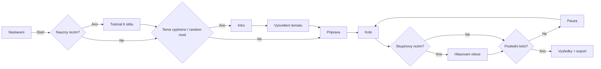

# Debatni casovac v3.1

Jednosouborova webova aplikace pro rizeni skolnich debat, turnaju a treninkovych kol.
Bezi offline primo v prohlizeci, bez backendu i bez instalace.

## Rychly Prehled

- Kompletny casovac debaty: intro, vysvetleni tematu, priprava, kolo, pauza, vysledky.
- 2 rezimy: dvojice 1v1 a skupiny s hlasovanim viteze.
- Rozsahla knihovna temat (vcetne obtiznosti, filtru, fulltextu, random modu po kolech).
- Import debatéru ze souboru: XLSX, XLS, CSV, TSV, TXT, PDF.
- Nauczny rezim (6 slidu) + samostatny modal Pravidla debaty.
- Pokrocile vysledky ve skupinach: wins, Buchholz, progressive score, oceneni.
- Vestaveny interaktivni pruvodce (4 specializovane tour).
- Persistovani nastaveni pres localStorage.
- CZ/EN prepinac jazyka v aplikaci (vsechny hlavni UI prvky, modaly a runtime ovladani).

## Tok Debaty

## Obrazovky A Funkce

| Obrazovka | Obsah |
|---|---|
| Setup | tema, knihovna, hledani, debatéri, rezim, casy, audio, tutorial, presety trid, import, validace |
| Tutorial | 6 kroku: zaklady debaty, pravidla, SEXI metoda, vyvraceni, chyby, rekapitulace |
| Intro | tema, strany PRO/PROTI, odpočet, struktura behu |
| Topic Explain | blurb + argumentacni napoveda pro obe strany |
| Run | aktivni faze, casovac, pary/skupiny, hlasovani, restart modal |
| Done | souhrn kol, export vysledku, ve skupinach navic TB ranking a oceneni |

## Ovladani

| Kontext | Klavesa | Akce |
|---|---|---|
| Intro / Run | Space | Pause/Resume |
| Run | N | Dalsi faze |
| Intro / Run | R | Otevrit restart modal |
| Global | Escape | Zavrit aktivni modal / ukoncit pruvodce |
| Theme switch | Enter/Space | Prepnout motiv |
| Theme switch | Sipky | Posun motivu |
| Walkthrough | ArrowLeft/ArrowRight | Predchozi/dalsi krok |

## Jazykova Lokalizace (CZ/EN)

- V hlavicce aplikace je prepinac `CZ` / `EN`.
- Vyber jazyka se uklada do localStorage (`debateTimerLang`).
- Lokalizace je aplikovana i na dynamicky generovane prvky (observer nad DOM).
- Pri behu debaty lze jazyk menit okamzite bez reloadu.

## Casovani, Zvuk, Hudba

- Kriticke beep alerty: 10, 5, 3, 2, 1 sekund.
- Velky countdown panel se aktivuje pod 10 sekund.
- Zvuky: start kola, konec kola, skip faze, vstup do hlasovani, finalni akord.
- Hudba bezi v priprave/pauze s oddelenou hlasitosti od signalu.

## Import Dat

Pipeline:

1. Nacteni souboru (drag and drop nebo file picker).
2. Parsing podle typu (text / SheetJS / PDF.js).
3. Normalizace jmeno/prijmeni/trida.
4. Kontrolni modal s editaci radku.
5. Aplikace do seznamu (replace/append/remove incomplete).
6. Volitelny zapis trid do presetu.

Import modal umi:

- filter: all / incomplete / konkretni trida
- editaci bunek inline
- hromadny checkbox vyber
- status radku (OK / missing first / missing last)

## Parovani A Bodovani

### Rezim Dvojic

- round-robin generovani kol
- pri lichém poctu hracu automaticke bye
- viteze urcujes klikem na stranu duelu

### Rezim Skupin

- kazde kolo random prerozdeleni skupin
- auto i manual group size
- hlasovani viteze kazdeho skupinoveho souboje
- poradi: wins -> Buchholz -> progressive

## Ukladana Data (localStorage)

- `debateTimerV2` - setup, casy, rezim, audio, filtry, random volby, tutorial, presety
- `debateTimerTheme` - aktivni motiv
- `debateTimerLang` - aktivni jazyk (cs/en)
- `wt_completed_tours` - dokoncene walkthrough tour

## Struktura Repozitare

- `debatni-casovac-v3.1.html` - kompletni aplikace (HTML/CSS/JS + data temat)
- `README.md` - dokumentace projektu
- `LICENSE` - Apache License 2.0
- `NOTICE` - povinne atribuční informace

## Kompletny Seznam Interaktivnich Prvku

<strong>Rozbalit seznam ID</strong>

### Setup

- `btnWalkthrough`
- `themeTrack`
- `langToggle`
- `langCs`
- `langEn`
- `btnRandomTopic`
- `btnClearTopic`
- `swRandomTopic`
- `topicTextarea`
- `playersTextarea`
- `topicCategory`
- `topicSearch`
- `btnDedupe`
- `btnClearPlayers`
- `modePairs`
- `modeGroups`
- `groupSizeInput`
- `groupSafeOff`
- `groupRoundsInput`
- `initTime`
- `roundTimeInput`
- `pauseTimeInput`
- `swTutorial`
- `swSound`
- `swMusic`
- `volSignal`
- `prevSignal`
- `volMusic`
- `prevMusic`
- `btnStart`
- `btnPravidla`
- `btnFullscreenHint`
- `presetSelect`
- `btnPresetAll`
- `btnPresetNone`
- `btnPresetReplace`
- `btnPresetAppend`
- `importDropZone`
- `importFileInput`

### Tutorial / Intro / Explain / Run

- `btnTutPrev`
- `btnTutNext`
- `btnSkipIntro`
- `btnBackToSetup1`
- `btnSkipExplain`
- `btnPause`
- `btnNext`
- `btnFullscreen`
- `btnRestart`
- `voteConfirmBtn`
- `btnConfirmRestart`
- `btnCancelRestart`
- `btnPravidlaClose`

### Import Modal

- `importChkAll`
- `importBtnApply`
- `importBtnAppend`
- `importBtnDelInvalid`
- `importBtnCancel`

### Walkthrough

- `wtClose`
- `wtBack`
- `wtNext`
- `wtSkip`
- `wtPickerClose`
- `wtPickerReset`

## Autorstvi A Licence

Autor projektu: **Jiri Pelikan**.

Projekt je publikovan pod licenci **Apache-2.0**. To znamena, ze jej muzou ostatni pouzivat, upravovat i redistribuovat podle podminek licence.

Pro zachovani puvodu a autorstvi je soucasti repozitare soubor `NOTICE`, ktery je nutne zachovat pri redistribuci podle podminek Apache-2.0.

## GitHub Pages

Repo je pripravene pro nasazeni na GitHub Pages (branch `main`, root `/`).
