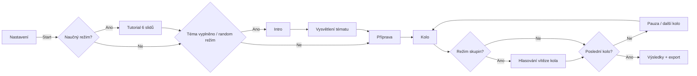

# Debatní časovač v3.1

Jednosouborová webová aplikace pro řízení školních debat, turnajů a tréninkových kol.
Funguje offline přímo v prohlížeči, bez backendu a bez instalace.

## Co Umí

- Ruční i náhodný výběr tématu z knihovny (188 témat, obtížnost 1-5, věkové štítky, kategorie).
- Režim ve dvojicích (1v1) i režim ve skupinách (losování skupin, hlasování vítězů, tabulka pořadí).
- Časování celého běhu debaty (intro, vysvětlení tématu, příprava, kolo, pauza, výsledky).
- Zvukové signály, hudba v pauzách, blikání při kritických časech, velký odpočet pod 10 s.
- Naučný režim se 6 slidy a samostatná modalita Pravidla debaty.
- Vestavěný interaktivní průvodce aplikací (4 specializované tour, try-it kroky, progress).
- Import debatérů ze souborů XLSX/XLS/CSV/TSV/TXT/PDF včetně kontrolního modalu a editace.
- Lokální perzistence nastavení přes localStorage.

## Životní Cyklus Debaty

## Kompletní Funkce Podle Obrazovek

### 1) Nastavení (screen-setup)

| Sekce | Co přesně obsahuje |
|---|---|
| Téma | Ruční text, náhodné téma, vymazání, knihovna témat, filtr sekce, fulltext, filtr obtížnosti, random téma každé kolo (all/pick), výběr kategorií a obtížnosti pro random režim |
| Debatéři | Textarea se jmény po řádcích, odstranění duplicit, vymazání seznamu, live počítadlo |
| Režim | Přepínač dvojice/skupiny; u skupin: auto bezpečné velikosti, volitelná vlastní velikost, počet kol, přerozdělení skupin po kole |
| Časy | Pauza na startu, čas kola, pauza mezi koly, živý odhad délky |
| Audio | Zvuky ON/OFF, hudba ON/OFF, samostatná hlasitost signálů/hudby, preview tlačítka |
| Naučný režim | Přepínač tutorialu před debatou |
| Presety tříd | Vestavěné presety 9.A / 9.B, výběr všech/ničeho, nahradit/přidat do seznamu |
| Import | Drag and drop / klik: xlsx, xls, csv, tsv, txt, pdf |
| Kontrola | Validace stavu vstupů a režimu, průběžné zprávy OK/varování |
| Motiv | Třípolohový přepínač dark / light / contrast (klik i klávesy) |
| Průvodce | Tlačítko Průvodce s výběrem tour |

### 2) Tutorial (screen-tutorial)

6 slidů:

1. Co je debata
2. Pravidla
3. Metoda SEXI
4. Jak vyvracet soupeře
5. Nejčastější chyby
6. Recap a start

Prvky: progress bar, čítač slidu, Zpět, Další/Začít debatu, adaptivní text v posledním kroku.

### 3) Intro (screen-intro)

- Téma, legendy stran PRO/PROTI, odpočet, stručná struktura běhu.
- Tlačítka: Přeskočit intro, Zpět.

### 4) Vysvětlení Tématu (screen-topicExplain)

- Blurb k tématu.
- Box argumentu pro obě strany včetně vlastních labelů tématu.
- Vlastní odpočet.
- Tlačítko Přejít na debatu.

### 5) Běh Debaty (screen-run)

- Top lišta: název fáze, podtitulek, čas, ovládací tlačítka.
- Mřížka párů/skupin (automatická optimalizace layoutu).
- Velký countdown panel při posledních 10 s.
- Bliknutí obrazovky při upozorněních.
- Ve skupinách hlasovací lišta s potvrzením až po označení všech vítězů.
- Restart modal s potvrzením.

### 6) Výsledky (doneWrap)

Režim dvojic:

- Souhrn všech kol.
- Zvýraznění vítězné strany v každém duelu.
- Tlačítko Nová debata.
- Tlačítko Kopírovat výsledky.

Režim skupin:

- Score table s pořadím, W/L průběhem, výhrami, TB (Buchholz).
- Tiebreak: wins -> Buchholz -> progressive.
- Ocenění (např. Neporazitelný, Comeback King, Giant Killer, série výher, Smolař).
- Detailní výpis všech skupinových duelů po kolech.
- Nová debata + Kopírovat výsledky.

### 7) Průvodce Aplikací (Walkthrough Engine)

Obsahuje 4 mini-tour:

1. Rychlý start
2. Témata a knihovna
3. Debatéři a import
4. Režim a nastavení

Funkce průvodce:

- Picker tour s doporučením a stavem Hotovo.
- Spotlight, tooltip, šipky, progress body.
- Try-it kroky (input/click/change validace).
- Klávesové ovládání vlevo/vpravo/Escape.
- Ukládání dokončených tour do localStorage.

## Ovládání A Klávesy

| Kontext | Klávesa | Akce |
|---|---|---|
| Intro / Run | Space | Pauza / Pokračovat |
| Run | N | Další fáze |
| Intro / Run | R | Otevřít restart potvrzení |
| Globálně | Escape | Zavřít aktivní modal / ukončit průvodce |
| Přepínač motivu | Enter/Space | Změna motivu |
| Přepínač motivu | Arrow keys | Posun mezi motivy |
| Průvodce | ArrowLeft/ArrowRight | Předchozí/další krok |

## Přesné Chování Časování A Zvuku

- Kritické alerty: 10, 5, 3, 2, 1 sekund.
- Velký panel odpočtu: aktivní pod 10 sekund.
- Zvuky:
- start kola
- konec kola
- skip fáze
- vstup do hlasování
- závěrečný akord po dokončení
- Hudba v pauzových fázích:
- Intro
- Init
- Pause

## Import Dat (XLSX/XLS/CSV/TSV/TXT/PDF)

### Pipeline

1. Načtení souboru (drop nebo file picker).
2. Parser podle typu:
- CSV/TSV/TXT -> text parser
- XLS/XLSX -> SheetJS (lazy load)
- PDF -> PDF.js (lazy load)
3. Normalizace jména/příjmení/třídy.
4. Kontrolní modal s editací řádků.
5. Aplikace do seznamu debatérů:
- Nahradit
- Přidat
- Odebrat neúplné
6. Volitelný zápis tříd do presetů.

### Import Modal Umí

- Filtrovat Vše / Neúplné / konkrétní třídu.
- Přímou editaci buněk (jméno, příjmení, třída).
- Hromadný checkbox výběr.
- Označit status každého řádku (OK/bez jména/bez příjmení).

## Párování A Bodování

### Ve dvojicích

- Generování kol round-robin stylem.
- Při lichém počtu hráčů automatické VOLNO (bye).
- Výběr vítěze klikem na stranu v kartě duelu.

### Ve skupinách

- Každé kolo cryptographically shuffled rozdělení.
- Auto i manuální velikost skupiny.
- Hlasování vítěze pro každý skupinový duel.
- Score per hráč + pokročilé pořadí:
- počet výher
- Buchholz (síla soupeřů)
- progressive score

## Ukládání Nastavení

Aplikace ukládá lokálně:

- debateTimerV2: téma, debatéry, časy, režim, audio, filtry, random nastavení, tutorial, presety.
- debateTimerTheme: vybraný motiv.
- wt_completed_tours: dokončené průvodce.

## Kompletní Seznam Ovládacích Prvků

<strong>Rozbalit úplný seznam interaktivních ID</strong>

### Setup

- btnWalkthrough
- themeTrack
- btnRandomTopic
- btnClearTopic
- swRandomTopic
- topicTextarea
- playersTextarea
- topicCategory
- topicSearch
- btnDedupe
- btnClearPlayers
- modePairs
- modeGroups
- groupSizeInput
- groupSafeOff
- groupRoundsInput
- initTime
- roundTimeInput
- pauseTimeInput
- swTutorial
- swSound
- swMusic
- volSignal
- prevSignal
- volMusic
- prevMusic
- btnStart
- btnPravidla
- btnFullscreenHint
- presetSelect
- btnPresetAll
- btnPresetNone
- btnPresetReplace
- btnPresetAppend
- importDropZone
- importFileInput

### Tutorial / Intro / Explain / Run

- btnTutPrev
- btnTutNext
- btnSkipIntro
- btnBackToSetup1
- btnSkipExplain
- btnPause
- btnNext
- btnFullscreen
- btnRestart
- voteConfirmBtn
- btnConfirmRestart
- btnCancelRestart
- btnPravidlaClose

### Import Modal

- importChkAll
- importBtnApply
- importBtnAppend
- importBtnDelInvalid
- importBtnCancel

### Walkthrough

- wtClose
- wtBack
- wtNext
- wtSkip
- wtPickerClose
- wtPickerReset

## Publikace Přes GitHub Pages

### Varianta A: ruční zapnutí

1. Otevři v repozitáři Settings -> Pages.
2. V Source nastav Deploy from a branch.
3. Vyber branch main a folder root (/).
4. Ulož a počkej na první build.

### Varianta B: workflow přes Actions

Pokud chceš build/deploy přes CI, použij oficiální Pages workflow a nasazuj obsah repozitáře automaticky při pushi.

## Struktura Repo

- debatni-casovac-v3.1.html -> kompletní aplikace (HTML + CSS + JS + data témat)
- README.md -> tato dokumentace
- LICENSE -> licenční podmínky
- .gitignore

## Autorství, Branding, Licence

- Autor: Jiří Pelikán
- Branding a autorství jsou součástí projektu (UI podpis + metadata v HTML).
- Použití, úpravy, redistribuce a komerční využití se řídí souborem LICENSE.

## Poznámka K Ochranně Díla

Technicky nelze zabránit tomu, aby kdokoli veřejně dostupný kód zkopíroval. Reálně se ochrana opírá o:

- jasné autorství v kódu i README,
- správně napsanou licenci,
- veřejnou historii commitů (důkaz původu),
- případně právní vymáhání při porušení licence.
