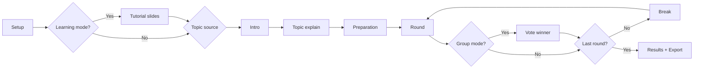

<h1 align="center">Debatni casovac v3.1</h1>

  One-file web app pro skolni debaty, argumentacni trening a turnajove rizeni kol.

  
  
  
  
  

  <a href="#quick-launch">Quick Launch</a> •
  <a href="#feature-deck">Feature Deck</a> •
  <a href="#learning-and-guides">Learning and Guides</a> •
  <a href="#audio-console">Audio Console</a> •
  <a href="#localization-czen">Localization</a>

---

## Stage Intro

Debatni casovac je navrzeny jako "open and run" aplikace. Zadna instalace, zadny backend, zadne zavislosti.

1. Otevretes [debatni-casovac-v3.1.html](debatni-casovac-v3.1.html) v prohlizeci.
2. Nastavite tema, debatery, mod a casy.
3. Spustite debatu a aplikace ridi cely flow az do vysledku.

> [!TIP]
> Pokud chcete demo do 30 sekund, zapnete Learning mode a pak Start debaty.

## Quick Launch

| Step | Co udelat | Vysledek |
|---|---|---|
| 1 | Otevri [debatni-casovac-v3.1.html](debatni-casovac-v3.1.html) | App bezi lokalne a offline |
| 2 | Vypln tema + debatery | Setup validace pripravi beh |
| 3 | Nastav mod, kola, casy, audio | Cely run je predkonfigurovany |
| 4 | Klikni `Start debaty` | Intro/Tutorial -> debata -> vysledky |

## Feature Deck

| Modul | Co umi |
|---|---|
| Debate Flow Engine | Setup -> Intro -> Topic Explain -> Prepare -> Round -> Break -> Results |
| Modes | 1v1 pairings + group mode s hlasovanim vitezu |
| Topic System | Manual entry, knihovna, filtry, fulltext, random topic per round |
| Learning Layer | 6-slide presentation + modal pravidel akademicke debaty |
| App Guide | Tour picker + 4 specializovane walkthroughs |
| Import Pipeline | XLSX/XLS/CSV/TSV/TXT/PDF + editable validation modal |
| Audio Layer | Signals, cues, music, separate volumes, preview buttons |
| Tournament Results | Round history, export, ranking, tiebreaks, awards |
| UX & Accessibility | Fullscreen, hotkeys, progress UI, aria labels, clear controls |
| Localization | CZ/EN na setupu, run screenech, guides, tutorialu i vysledcich |

## Debate Flow Map

## Runtime Control Panel

| Context | Shortcut | Akce |
|---|---|---|
| Intro / Run | `Space` | Pauza / pokracovat |
| Run | `N` | Dalsi faze |
| Intro / Run | `R` | Potvrzeny restart |
| Global | `Escape` | Zavrit modal / ukoncit guide |
| Walkthrough | `ArrowLeft` / `ArrowRight` | Predchozi / dalsi krok |

Runtime hint (pevna veta podle jazyka):

- CZ: Ovladani behem behu: Mezernik pauza/pokracovat, N dalsi faze, R restart.
- EN: Controls during runtime: Space pause/resume, N next phase, R restart.

## Learning And Guides

### Learning mode (presentation)

Learning mode je onboarding pred ostrou debatou. Obsahuje 6 slidu:

1. Co je debata
2. Pravidla akademicke debaty
3. Model argumentace SEXI
4. Jak vyvracet soupere
5. Nejcastejsi argumentacni chyby
6. Shrnuti a plynuly start

Slide deck ma pevne CZ/EN mapy a pri prepnuti jazyka se okamzite prekresli.

### App guide modules

Guide picker obsahuje sekce a texty jako:

- App guide
- Choose the part you want to explore
- Recommended
- Reset tours

| Tour | Steps | Scope |
|---|---:|---|
| Quick start | 5 | tema, debateri, start, basic flow |
| Topics and library | 6 | manual topic, filters, library, random topic mode |
| Debaters and import | 6 | list management, class presets, file import, validation |
| Mode and settings | 8 | theme, mode, timing, signals, music, learning mode, hotkeys |

Kazdy guide krok ma progress, focused highlight, keyboard navigation a reset stavu.

## Topics And Library

| Funkce | Detaily |
|---|---|
| Sectioned library | Temy jsou rozdelene do tematickych sekci |
| Topic metadata | obtiznost, blurb, argumentacni hints |
| Fulltext search | hleda v nazvu, popisu i argumentech |
| Random topic mode | umi losovat nove tema na kazde kolo |
| Bilingual topic text | CZ/EN mapy pro title, blurb, PRO/CON |

## Debaters, Pairing, Scoring

### Pair mode (1v1)

1. Round-robin parovani.
2. Automaticke BYE pri lichych poctech.
3. Manual winner selection per duel.

### Group mode

1. Dynamicke skupiny po kolech.
2. Auto/group size podle nastaveni.
3. Vitez se voli v kazde skupine.
4. Ranking: vyhry -> Buchholz -> progressive score.

### Results and awards

Results panel obsahuje round history, export do schranky, final ranking a tematicka oceneni.

## Import Console

### Supported files

1. `.xlsx`, `.xls`
2. `.csv`, `.tsv`
3. `.txt`
4. `.pdf`

### Validation modal capabilities

1. Filtry `vse / neuplne / trida`.
2. Hromadny vyber radku.
3. Inline editace `jmeno / prijmeni / trida`.
4. Stavove tagy: OK, chybi, bez jmena, bez prijmeni, prazdne.

## Audio Console

| Audio block | Chovani |
|---|---|
| Time alerts | upozorneni pri 10 / 5 / 3 / 2 / 1 sekundach |
| Start cue | signal startu faze/kola |
| End cue | signal konce faze/kola |
| Skip cue | signal pri rucnim preskoceni |
| Voting cue | signal pri vstupu do hlasovani |
| Final chord | zaverecny audio marker |
| Background music | priprava + pauzy mezi koly |
| Volume model | oddelene hlasitosti pro signaly a hudbu |
| Preview buttons | rychly test signalu i hudby v setupu |

## Localization CZ/EN

Lokalizace je lokalni, okamzita a deterministicka. Nepouziva externi API.

| Coverage zone | Status |
|---|---|
| Setup UI | mapped |
| Intro + Topic explain | mapped |
| Runtime phases + hints | mapped |
| Tutorial slides | mapped |
| App guide picker + steps | mapped |
| Topic library text pack | mapped |
| Results + export | mapped |

Persistence klice:

| Key | Purpose |
|---|---|
| `debateTimerV2` | setup, casy, mode, audio, filtry, random, tutorial, presets |
| `debateTimerTheme` | aktivni theme |
| `debateTimerLang` | aktivni jazyk (`cs` / `en`) |
| `wt_completed_tours` | dokonceny progress guide tour |

## One-file Architecture

Aplikace je runtime kompletne v [debatni-casovac-v3.1.html](debatni-casovac-v3.1.html).

| Layer | Role |
|---|---|
| DATA: PRESETS | vychozi debater lists |
| DATA: TOPIC_LIBRARY | tematicka knihovna |
| I18N | CZ/EN mapy + runtime prepinac |
| FILE IMPORT ENGINE | parser + validator + modal editing |
| AUDIO ENGINE | cues, music, fade, preview |
| MATCHING / SCORING | pairings, standings, tiebreaks |
| RENDER ENGINE | intro, explain, run, done |
| WALKTHROUGH ENGINE | app guide modules, steps, progress, reset |

## Repository Layout

| File | Purpose |
|---|---|
| [debatni-casovac-v3.1.html](debatni-casovac-v3.1.html) | cela aplikace |
| [README.md](README.md) | dokumentace |
| [LICENSE](LICENSE) | Apache License 2.0 |
| [NOTICE](NOTICE) | atributacni informace |

## Author And License

Author: Jiri Pelikan.

Licensed under Apache License 2.0.
